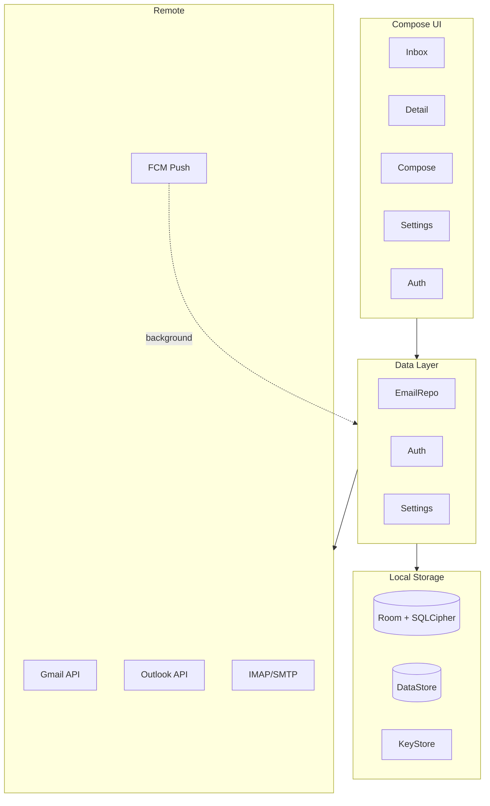

# MonoMail

[](https://github.com/shrivatsav-0/monomail/releases/latest)
[](LICENSE)
[](https://developer.android.com/about/versions/8.0)
[](https://kotlinlang.org)
[](https://discord.gg/monomail)
[](https://ko-fi.com/N4N2W53M5)

Monochrome email client for Android — Jetpack Compose, Material 3 Expressive. No colour accents, no noise, just email.

[Website](https://monomail.millosaurs.me) · [Download APK](https://github.com/shrivatsav-0/monomail/releases/latest) · [Discord](https://discord.gg/monomail)

> [!WARNING]
> **Gmail API test-user quota (100 users).** The app is not published on the Play Store. If Google shows "This app is blocked", the test-user quota is exhausted. Run from source with your own Google Cloud project, or use an Outlook account (no such limit).

---

## Features

| Category | Highlights |
|---|---|
| **Inbox** | Pull-to-refresh, paginated scroll, swipe gestures (configurable L/R), long-press actions, bulk multi-select, smart sender grouping, snooze (1hr/tomorrow/weekend/next week), undo toast (4s), date headers, scroll position retention per tab, calendar badge for scheduled, mark-all-read |
| **Conversation** | Collapsible thread view, inline chain view (configurable), CC/BCC expand, thread connecting lines, alternating backgrounds |
| **Search** | Local client-side filter (subject/sender/snippet), server-side API search with pagination |
| **Multi-Account** | Up to 10 accounts (Gmail, Outlook, IMAP), unified inbox toggle, swipe-to-switch avatar, profile card |
| **Compose** | Reply/Reply-all/forward, CC/BCC, contact autocomplete, file attachments (any MIME), schedule send, undo send (5-30s configurable), send-as aliases, email templates, formatting toolbar (B/I/U/lists/quote), PGP encrypt & sign, WebView contenteditable editor |
| **Settings** | Hub-and-spoke navigation — Appearance (theme, font scale, dividers, compact, remote images, markdown, email colors), Inbox (swipe config, smart grouping), Compose (reply mode, confirm-send, undo window, templates), Navigation (dock size, tab editor), Notifications (sync frequency, per-account channels), PGP key management |
| **PGP** | Ed25519/X25519 key generation, ASCII-armored import/export, auto-decrypt + signature verification, passphrase-protected keys, encrypt & sign on outgoing |
| **Detail view** | HTML rendering (WebView, JS disabled), algorithmic dark mode (AndroidX WebKit), collapsible quoted text, responsive email detection, remote image blocking with per-email override, CSP `default-src 'none'`, HTML sanitization (no Jsoup), inline image previews (max 280dp), attachment grid (2-4 columns), font scaling (0.8x-1.3x) |
| **Notifications** | Adaptive WorkManager sync (2min foreground, 15min backoff), per-account channels (sound/vibration), inline reply via RemoteInput, archive+undo from shade, parallelised multi-account sync |
| **Micro-interactions** | Spring physics throughout — press-scale on cards/buttons, animated dock tabs, bounce on theme selector, `animateContentSize` for expand/collapse, sent overlay animation, slide+fade navigation transitions |

### Account management

- **Gmail** — Android Credential Manager + Google Identity Services
- **Outlook** — MSAL 5.4.0 with silent token refresh
- **IMAP/SMTP** — provider presets (Gmail, Outlook, Yahoo, Zoho, Custom) with connection testing
- AES-GCM encrypted credential storage (Android KeyStore)
- Provider-scoped sign-out

## Architecture



| Layer | Technology |
|---|---|
| UI | Jetpack Compose, Material 3 Expressive, Navigation Compose |
| Language | Kotlin 2.2 |
| DI | Hilt |
| Networking | Retrofit 2, OkHttp 4 |
| Database | Room + SQLCipher |
| Auth | Google Credential Manager, MSAL 5.4.0 |
| IMAP/SMTP | Eclipse Angus Mail (Jakarta Mail 2.x) |
| PGP | PGPainless 2.0.3 (Bouncy Castle) |
| Images | Coil Compose |
| Markdown | Markwon 4.6.2 |
| Background | WorkManager + ActionQueueManager |
| Secure storage | AndroidX Security Crypto |

## Getting Started

### Prerequisites

- Android Studio Ladybug+
- JDK 17+
- Google Cloud project with Gmail API enabled
- Azure App Registration (Outlook/Microsoft Graph — scopes: `Mail.Read`, `Mail.ReadWrite`, `Mail.Send`, `User.Read`; redirect URI: `msal{client_id}://auth`)

### Setup

```bash
git clone https://github.com/shrivatsav-0/monomail.git
```

Create `secrets.properties` for the `playstore` flavor:

```properties
GOOGLE_CLIENT_ID=your_web_client_id_here
```

Configure MSAL (optional — `app/src/main/res/raw/msal_config.json`):

```json
{
  "client_id": "your_msal_client_id",
  "authorities": [{"type": "AAD", "audience": "AzureADandPersonalMicrosoftAccount"}],
  "redirect_uri": "msal{your_client_id}://auth"
}
```

Minimum SDK: 26 (Android 8.0).

### Builds

| Flavor | Description |
|---|---|
| `playstore` | Bundled with the developer's official Google OAuth Web Client ID. Push notifications via FCM. |
| `github` | Excludes private OAuth client ID. Google Sign-In temporarily disabled during OAuth verification — use Outlook or IMAP in the meantime. |

```bash
./gradlew installPlaystoreDebug   # or installGithubDebug
```

## Contributing

PRs welcome. Open an issue first for significant changes.

```
Fork → Branch → Commit → Pull Request
```

## License

[GPL-3.0](LICENSE)

---

Built by [Shrivatsav](https://github.com/shrivatsav-0)
